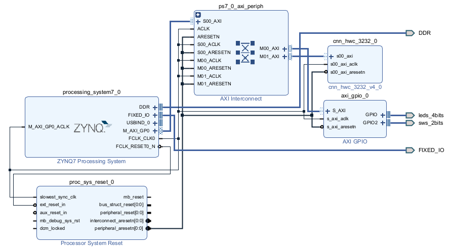

# open-hw-cnn-zynq-wrap
This is the wrapper to use the open hardware CNN accelerator framework on a Zynq device.

## Overview
This project connects the IP blocks from the `open-hw-cnn` framework with the Zynq Processing System. The IP blocks are already built and located in the `ip_repo` folder, where all IPs used in the block design are stored. The subproject `open-hw-cnn` is only available in case new IPs need to be generated. If you need to modify the IP, there is no current automation for creating a new IP. I plan to add this automation, possibly using a Tcl script or Python.

## Build Process

### Step 1: Building the IP (if needed)
If you need to generate new IPs, you must first build the `open-hw-cnn` subproject. The process is the same as for this main project. Open Vivado, go to **Tools**, and select **Run Tcl Script**. Choose the `build.tcl` script from the `open-hw-cnn` project. Once Vivado has created the subproject, you can close it.

### Step 2: Building the Main Project
After building the subproject (if required), you can run the main `build.tcl` script from this wrapper project to create the entire design. Simply open Vivado, go to **Tools**, select **Run Tcl Script**, and choose the `build.tcl` script from this repository.

### Note
The current wrapper project is not compatible with the latest version of Vivado. I will need to create a completely new `build.tcl` script to ensure compatibility.

## Block Design
The image below shows the block design of this project:

## Todo
- Automate the creation of new IP blocks (Tcl script or Python)
- Update the build process for Vivado compatibility
- Create a new `build.tcl` script for the wrapper project

## What This Project Does
This project connects the CNN accelerator IP with the Zynq Processing System. The IPs, including those from the `open-hw-cnn` subproject, are part of the block design and are used to accelerate CNN processing on Zynq devices.

## Converting LaTeX to Markdown
If you're considering posting detailed project documentation, you could consider converting your thesis (in LaTeX) to Markdown. There are tools available that allow for this conversion, although some manual adjustments might be needed.
